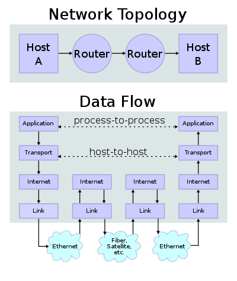

# Examination networks

- **Physical adress** (MAC or Media Access Control)
  
  - Identifies a device to other devices on the same local network
  
  - Consists of 12 hexadecimal digits
  
  - First half of the number is typically used as a manufacturer ID
  
  - Second half is a device identifier
  
  - Unique to the network card installed on a device

- **IP** (Internet Protocol) **address**
  
  - Identifies the device globally
  
  - Can be changed

- **Netmask**
  
  - 32-bit "mask" used to divide an IP address into subnets and specify the network's available hosts
  
  - Netmask defines how *large* a network is
  
  - **Example**: IP: `192.168.55.0`, Netmask: `255.255.225.0`
    
    - Applies to IPs in the 192.168.55.0 - 192.168.55.255 range

- **Default gateway**
  
  - Hardware node that facilitates smooth connections between networks
  
  - Intermediate device between the local network and the internet
  
  - In case of smaller networks: the main router

### TCP-IP model

- Application layer
  
  - Protocols such as: `HTTP, HTTPS, SMTP, FTP, ...`

- Transport layer
  
  - Protocols
    
    - **TCP** (Transmission Control Protocol)
      
      - <u>Does guarantee</u> delivery of packets
      
      - For example: movies, etc.
      
      - They do tend to buffer as you don't want to miss a few seconds or a minute of a movie
    
    - **UDP** (User Datagram Protocol)
      
      - <u>Does not guarantee</u> delivery of packets
      - For example: video chat, live video, etc.

- Network layer
  
  - Internet protocol

- Physical layer
  
  - Enables the physical connection between the networks
  
  - Transports the bits

### Protocols

- HTTP (Hypertext Transfer Protocol)
  
  - Web browser
  
  - HTML, PHP, ...

- SMTP (Simple Mail Transfer Protocol)

- FTP (File Transfer Protocol)

- SSH (Secure Shell)

- SNMP (Simple Network Management Protocol)

### Ports

- Communication endpoint

- Identifies a specific process or a type of network service
