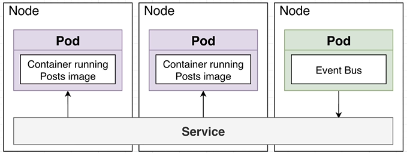
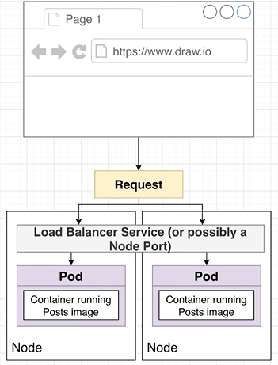

# Kubernetes

**Kubernetes Cluster**: A collection of nodes + a master to manage them

**Node**: A virtual machine that will run our containers

**Pod**: More or less a running container. Technically, a pod can run multiple containers (we won't do this)

**Deployment**: Monitors a set of pods, make sure they are running and restarts them if they crash

**Service**: Provides an easy-to-remember URL to access a running container

### Objects

```yaml
apiVersion: v1 # Version of the Kubernetes API you're using to create this object
kind: Pod # Type of object you want to create
metadata: # Config options for the object ware are about to create
  name: posts # Name for the object
spec: # Attributes for the object
  containers: # You can create many containers in a single pod
    - name: posts # Make a container with name of 'posts'
      image: loeka1234/posts:0.0.1 # Image you want to use
```

**containers** is an array.

### Services



Services provide networking between pods.

**Types** of services:

- Cluster IP
  
  - Sets up an easy-to-remember URL to access a pod
  
  - Only exposes pods in the cluster

- Node Port
  
  - Makes a pod accessible from outside the cluster
  
  - Usually only used for dev puposes
  
  - Gets a random 3xxxx port

- Load balancer
  
  - Makes a pod accessible from outside the cluster
  
  - This is the right way to expose a pod to the outside world
  
  

- External Name
  
  - Redirects an in-cluster request to a CNAME url

### Ingress or Ingress Controller

A pod with a set of routing rules to distribute traffic to other services.

**NextJS SSR** request to **ingress-nginx**

- Use `http://SERVICENAME.NAMESPACE.svc.cluster.local`

- **Note**: Include `Host` in your headers as ingress-nginx has rules specified for a specific domain
  
  - NextJS has a `req` object which includes the headers from the request
    
    ```javascript
    HomePage.getInitialProps = async ({ req }) => {
    	if (typeof window === "undefined") // If request is made server side
    		return await axios
    			.get(
    				"http://SERVICENAME.NAMESPACE.svc.cluster.local",
    				{
    					headers: req.headers,
    				}
    			)
    			.then(res => res.data);
        else // Put logic here for client side request
    };
    ```


