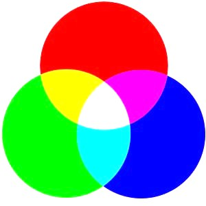

# Multimedia

## Images

An image is build out of pixel. Each pixel has an RGB (red, green, blue) value. The red, green and blue are all 1 byte (representing a number between 0 and 255). 

You also have hexadecimal colors. The hexadecimal number system uses 16 numbers instead of 10 (1, 2, 3, 4, 5, 6, 7, 8, 9, 10, A, B, C, D, E, F). Hexadecimal colors contain 6 hexadecimal numbers. 2 for red, 2 for green and 2 for blue.

Image compressing

- Losslessly
  
  - Using the same bits for each pixel that has the same color

- Lossely
  
  - Throwing information away
  
  - 
